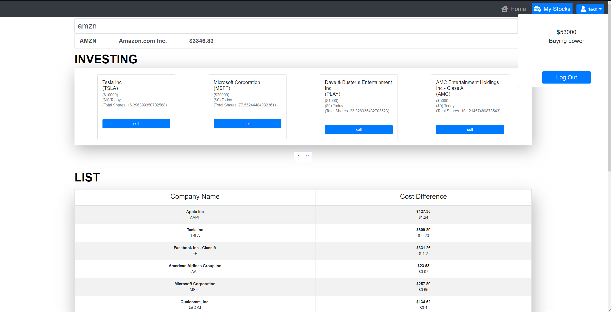
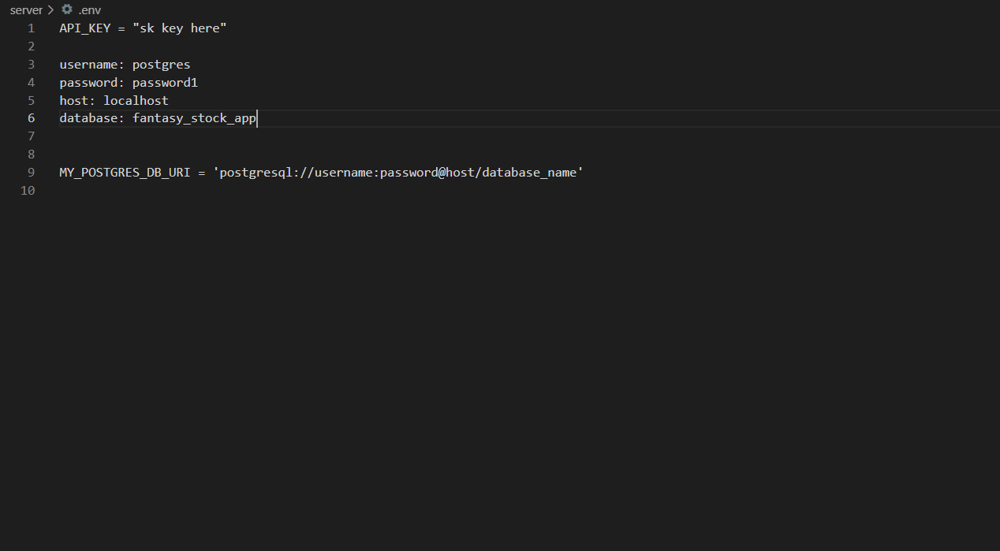
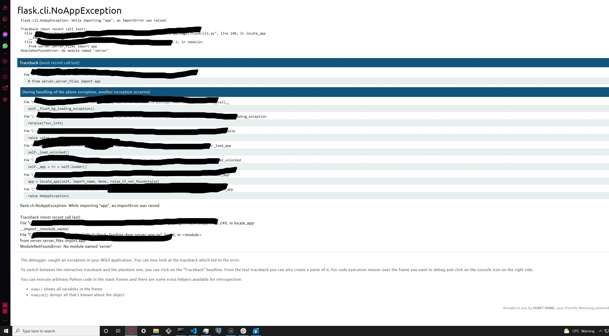

# Stock Trading App 

- This application allows users to invest in Stock Exchange with fake currency.
- This project client side was built entirely in ReactJS 
- This project server side was built entirely in Flask/Python  
- This project uses [IEX Cloud](https://iexcloud.io)

[Want to Invest? Click here!](fantasy-stock-trading-app.herokuapp.com)

## Instructions

## Start Stock Trading

1. You will need to register in order to start buy/sell stocks.
2. After registration, the app it's as simple as search for the desired stock you want to invest in!

## In order for this repository to work properly, if ever clone or download, please follow these steps below

1. Make sure you have Python installed on your local machine before following the guide below.

- Open your CMD (Command Prompt) or git bash (if downloaded already)
- Navigate to `server` and download the require packages listing below using Python Package Manager `pip`
  - [python-dotenv](https://pypi.org/project/python-dotenv/)
  - [requests](https://requests.readthedocs.io/en/latest/user/install/#install)
  - [Flask](https://flask.palletsprojects.com/en/1.1.x/installation/#install-flask)

3. Inside `server` directory, create a file name `.env` **Don't forget the dot (.)**
4. Before getting to the next step:
    - Make sure to have a [Developer IEX Cloud Account](https://iexcloud.io/cloud-login#/register). If not already then create an account in order to generate your API Key necessary for this project to function correctly.
6. Navigate or open `.env` file and add _exactly_ what the screenshot below has

## Important changes to make before app runs correctly
1. Now, you will have to modify 4 files.
    - In `app.py` change `from server.server_files import app` to `from server_files import app`
    - In `routes.py` change 
        - `from server.server_files import app, db bcrypt` to `from server_files import app, db, bcrypt`
        - `from server.server_files.models import Users, Transactions, Stock` to `from server_files import Users, Transactions, Stock`
    - In `models.py` change `from server.server_files import db` to `from server_files import db`
    - In `__init__.py` change `from server.server_files import routes` to `from server_files import routes`
- The reason to make these changes above is to prevent `ImportError` like shown on the screenshot below

## Summary

My first Full Stack application ever built, really enjoyed and had fun while building this project. The challenges faced while making this project has enforced my understading of ReactJs Hooks, HTTP requests & Promises, as well as creating a PostgreSQL Database. Thus, using an Object-Relational-Mapper (ORM) like [Flask_SQLAlchemy](https://flask-sqlalchemy.palletsprojects.com/en/2.x/) to facilitate the process of creating/updating/deleting data in the database. In addition, using my local machine CMD (Command Prompt) to exposed myself more to SQL statements or [PostgreSQL](https://www.postgresql.org/docs/) syntax.

## Setting up Database

1. Install PostgreSQL
2. Run **backup.sql** scripts in sql_backups directory